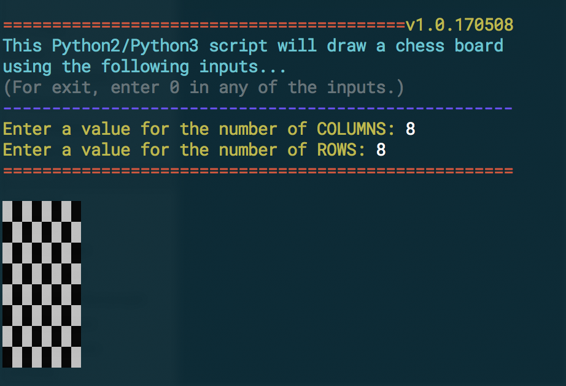

# Chess Board

The chess.js (JavaScript) and chess.py (Python 2.x or 3.x) scripts will draw a chess board base on user input values of Columns and Rows.  The scripts were programmer with the use of two `For Loops`.  The scripts creates a string that represents an X's by X's grid, using newline characters to separate lines. At each position of the grid there is either a white space or a black space. The spaces will form a chess board.

 Figure 1: ScreenShot Chess Script
